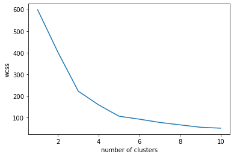

# Heart Failure Clustering with Python

This is a clustering project using Python on a data set of patients that suffered from heart failure. Our goal was to use different clustering algorithms to separate the patients into groups, according to their ejection fraction and level of serum creatinine, then compare the results. The tested algorithms were k-means, hierarchical clustering and DBSCAN (Density Based Spacial Clustering of Applications with Noise). The first two led to very similar clusters, with 5 groups, while the later led to 7 groups (plus the unassigned entries).

## 1. Introduction

Heart failure happens when the heart is unable to pump the amount of blood required by the rest of the body. In their paper ["Machine learning can predict survival of patients with heart failure from serum creatinine and ejection fraction alone"](https://bmcmedinformdecismak.biomedcentral.com/articles/10.1186/s12911-020-1023-5), Davide Chicco and Giuseppe Jurman show that machine learning classifiers can be used to predict whether or not a given patient with heart failure will survive. 

In this project, we use the same data set but, instead of classification, we use it for clustering, with the intent that a doctor might use this information to identify which groups of patients are at higher risk.

The file *heart_failure_clinical_records_dataset.csv* was downloaded from https://archive.ics.uci.edu/ml/datasets/Heart+failure+clinical+records at 15:17 (BRT) of 12/08/2022.

## 2. Preprocessing

Before we apply our clustering algorithms, we must choose which of the thirteen attributes of the data set we will use. According to the paper by Chicco and Jurman, the classification algorithms performed best when using only ejection fraction and serum creatinine as predicting attributes. We will, therefore, make the same choice, since, with only two attributes, the groups will be simpler to interpret and visualize.

Once we have selected our attributes, we must employ the standard scaler to ensure that all of our data is in the same scale. We can visualize our result in the scatter plot below.

## 3. K-Means

The first clustering algorithm we will employ is the k-means one. This algorithm will start with k centroids scattered across the samples, each point will then be assigned to the centroid that is nearest to it, forming k clusters. Once that is done, the centroids’ position is restarted to that of the mean position of its cluster and we repeat the process until the groups don’t change anymore.

To choose how many clusters we are going to create, we employ the elbow method, also know as wcss (within-cluster sum of squares) method. As the name suggests, the idea behind this method is to minimize the total distance between the samples and their centroids. To do this, we graph the within-cluster sum of squares and choose the number for clusters for which the decrease slows down (the “elbow”). Analyzing the graph below, we choose 5 clusters.

Since the k-means algorithm has no other parameters, we can now perform the clustering, the result of which can be visualized in the scatter plot below.

## 4. Hierarchical Clustering

Next, let us test the hierarchical clustering algorithm. This algorithm will first build a dendrogram, in which the size of the vertical lines is proportional to the distance between two points (or groups of points).

We use the dendrogram to determine how many clusters we will have. To do so, we draw a horizontal line across it, such that we have one cluster for each intersection between this line and a vertical line. To determine where we should draw this new line, we choose a long vertical line with the fewest intersections with other horizontal lines. Analyzing our dendrogram, we obtain that the optimal number of clusters is either 4 or 5. We choose 5.

The clustering result can be visualized in the scatter plot below. We can see that the clusters are very similar to the one obtained by the k-means algorithm, although with a smaller group 4.

## 5. DBSCAN

Finally, we will test the DBSCAN algorithm. This algorithm groups together samples that are in the neighborhood of each other, forming the clusters. In this algorithm we don’t choose how many clusters there will be, but must test different values for other parameters to ensure we obtain a good clustering.

The two parameters we are going to use are eps, which is the maximum distance between two samples for one to be considered as in the neighborhood of the other, and min_samples, which is the number of samples in a neighborhood for a point to be considered as a core point.

Using the standard values of 0.5 for eps and 5 for min_samples, we seem to obtain two clusters, labeled 0 (with 285 samples) and -1 (with 14 samples). However, the -1 label indicates samples which weren’t assigned to any group, so in truth, we have only one cluster. Testing different values for the two parameters, we eventually settle on eps=0.35 and min_samples=5, which leads to 7 clusters, plus 30 unassigned samples.

As we can see, this is a very different result from the one obtained for the k-means and hierarchical clustering algorithms.

## 6. Conclusion

According to Chicco and Jurman, the ejection fraction and level of serum creatinine of a patient who had heart failure are enough to predict whether or not that patient will survive. Inspired by this result, we used the same data set and these same two attributes, but for clustering, with the intent that a doctor might use this information to identify patients who are at higher risk.

We employed three different clustering algorithms: k-means, hierarchical clustering and DBSCAN. While the first two led to similar results, the third one led to a significantly different clustering. All three of the results might be useful in a doctor’s hands to determine the danger to a given patient.
